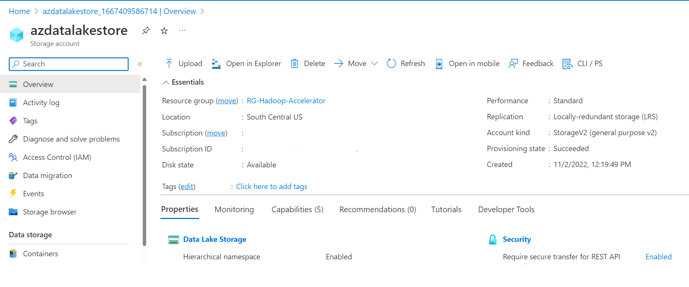

# Accelerator

## Efficient Solution Migration

### Discovery and Assessment

1. Todo - Steps - 1
    - Describe steps
      
2. Todo - Steps - 2
3. Todo - Steps - 3
4. Congratulations!! At this point you have successfully completed discovery and produced analysis results

    

### Explore existing Hadoop environment and run typical HiveQL queries

1. Todo - Steps - 1
    - Describe steps
      
2. Todo - Steps - 2
3. Todo - Steps - 3
4. Congratulations!! At this point you have successfully setup Cloudera Hadoop cluster. Mounted raw dataset and explored several typical queries

    

### Migrate raw data from Hadoop File System to Azure Data Lake Storage gen2 using Azure Data Factory

1. Todo - Steps - 1
    - Describe steps
      
2. Todo - Steps - 2
3. Todo - Steps - 3
4. Congratulations!! At this point you have successfully migrated data from Cloudera Hadoop Cluster to Azure Data Lake Storage using Azure Data Factory

    

### Migrate raw data from Hadoop File System to Azure Data Lake Storage Gen2 using WanDisco partner solution

1. Todo - Steps - 1
    - Describe steps
      
2. Todo - Steps - 2
3. Todo - Steps - 3
4. Congratulations!! At this point you have successfully migrated data from Cloudera Hadoop Cluster to Azure Data Lake Storage using WanDisco partner solution

    

### Setup DataBricks environment and run matched SparkSQL queries. Explore the results

1. Todo - Steps - 1
    - Describe steps
      
2. Todo - Steps - 2
3. Todo - Steps - 3
4. Congratulations!! At this point you have successfully setup DataBricks cluster. Mounted raw dateset as Azure Data Lake Storage (ADLS) GEN2 and explored the queries converted from HiveQL

    