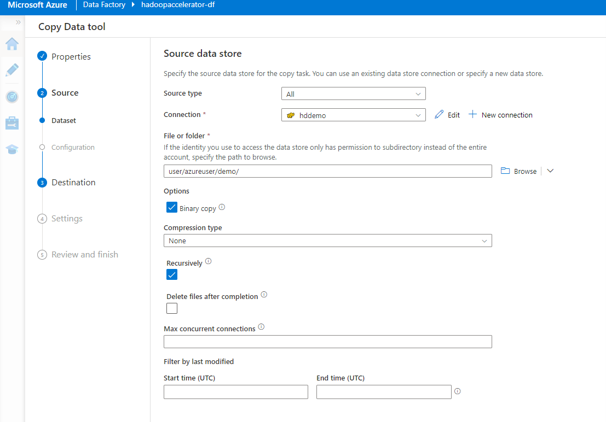
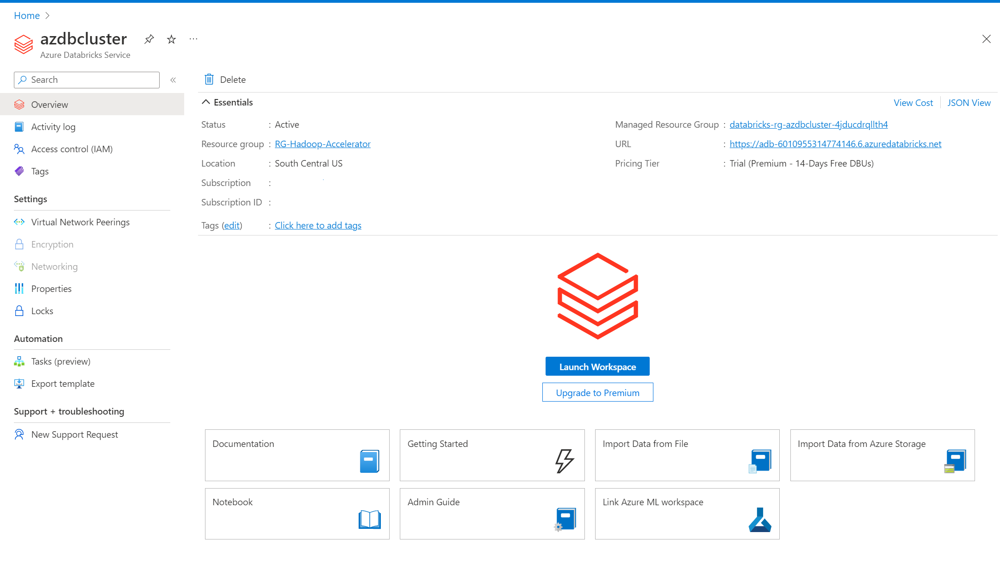
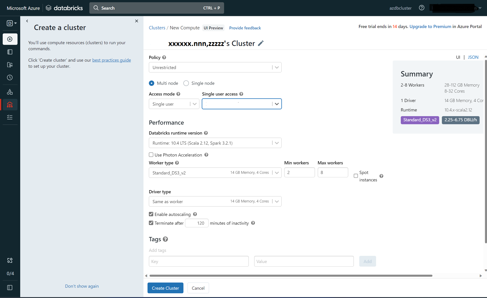
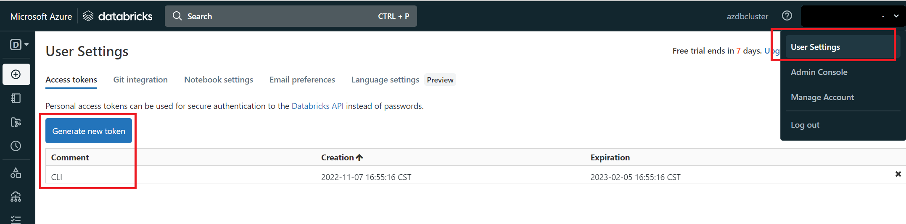

# Accelerator

## Efficient Solution Migration

### Discovery and Assessment

1. Todo - Steps - 1
    - Describe steps
      
2. Todo - Steps - 2
3. Todo - Steps - 3
4. Congratulations!! At this point you have successfully completed discovery and produced analysis results

    

### Explore existing Hadoop environment and run typical HiveQL queries

### Setup

    Before starting the workshop, set up the hadoop environment (cloudera) that you will use to migrate data to adls. To save costs, the environment consists of a single node cluster. This cluster runs Cloudera 5.16.2 and Kafka 3.1, to simulate a legacy system.

Perform the following tasks:

1. Sign in to the Azure portal using a web browser.

2. On the Home page, click Subscriptions.

    

3. Make a note of the Subscription ID associated with your account.

    
    
4. In the toolbar, click Cloud Shell.

    

5. In the Cloud Shell dropdown list, select PowerShell. Click Confirm if prompted.

    

6. In the Cloud Shell toolbar, select Open new session.

    

7. Run the command shown below to retrieve the script that create the resources and the virtual machine that will be used to run Cloudera.
    
        wget https://raw.githubusercontent.com/JohnPWSharp/MigrationWorkshop/main/clouderasetup.ps1

8. In the Cloud Shell toolbar, select Open editor.

    

9. In the Files pane of the editor, select clouderasetup.ps1 to open the setup script. In the script, replace <your-subscription-id> with your subscription id, and replace <SAS> with the SAS URL of the cloudera disk that will be used to create the virtual machine. Your instructor should provide you with this URL.

    

10. Press CTRL-S to save the file, and then press CTRL-Q to leave the editor.

11. Run the script with the following command:

        .\clouderasetup.ps1
        
    As the script runs, you will see various messages when the resources are created. The script will take about 5 minutes to complete. When it has finished, it will display the IP address of the new virtual machine. Make a note of this address.

    

12. Connect using SSH as the root user as shown below. Replace <ip address> with the IP address of the virtual machine. The password is Pa55w.rdDemo. Enter yes when prompted to connect.

    NOTE:
    You may need to wait for a minute while the virtual machine services start before continuing

        ssh root@<ip address>

13. At the bash prompt, run the following command to set the password for the azureuser account. Provide a password of your own choosing. You'll use this account rather than root for running the Cloudera services.

        passwd azureuser

14. Run the following command to sign out from the virtual machine and return to the PowerShell prompt:

        exit

15. In the Azure portal, close the PowerShell pane.

16. On the desktop, open a Web browser, and navigate to the URL <ip-address>:7180, where <ip-address> is the IP address of the virtual machine you noted earlier. You should see the Cloudera Manager login page.

        NOTE: Again. you may need to wait for a minute while the Cloudera Manager is initialized.

    

17. Log in with the username admin with password admin.

18. In the Cloudera Manager, select the drop-down menu for the Cloudera Management Service, select Start, wait for the management service to start up correctly, and then select Close.

    

19. Select the drop-down menu for the Cluster 1 cluster, select Start, wait for the various services (Zookeeper, HDFS, Kafka, HBase, Yarn, Spark, and Hive) to start, and then select Close.

    

20. Verify that all services are shown as running correctly.

    NOTE: You may receive a warning from HDFS and/or Zookeeper initially, but they should clear after a minute or so.

    

21. Log into the edge node using azureuser
    
         ssh azureuser@<ip address of the edgenode>

    

22. Copy the files from git repo to edge node for the test runs

        wget <github link to data>
        
23. Copy the raw data to hdfs location

24. Copy sample hql file

        wget <github link to sample hive hql file>  

25. Run the hive file as a job.

        hive -f <hive ql file>

26. Validate the hive tables.

27. Run the sample queries.

28. Congratulations!! At this point you have successfully setup Cloudera Hadoop cluster. Mounted raw dataset and explored several typical queries

    

### Migrate raw data from Hadoop File System to Azure Data Lake Storage gen2 using Azure Data Factory

1. Todo - Create ADLS Gen2
    - Describe steps
      

2. Launch Microsoft Edge or Google Chrome web browser. Currently, Data Factory UI is supported only in Microsoft Edge and Google Chrome web browsers.
    

3. Go to the Azure Data Factory Studio and choose the Create a new data factory radio button.

4. You will automatically enter the homepage of the Azure Data Factory Studio once the data factory resource is created
        
5. Click on the Ingest tile to start the Copy Data tool.
    

6. On the Properties page of the Copy Data tool, choose Built-in copy task then click Next.

7. Click on New Connection
    

8. Search for HDFS and click continue.

9. Enter your cluster information and leave authentication type as Anonymous
    

10. Enter the location of the files to be transferred from HDFS to ADLS. The path should be: user/azureuser/demo/
    

11. Specify the target system to land the airport data stored in HDFS by selecting Azure Data Lake Storage Gen2
    

12. Click New Connection and select the Azure subscription and Storage account to house the airport data being migrated.
    

13. Click Test connection to ensure all is set properly.

14.	Click on Browse to navigate to the target folder (flights) in the desired destination then select Next
    

15.	Provide a name to the copy data task to be created, then run the pipeline
    

16. Once the pipeline run is completed, verify that it was run successfully. Navigate to the ADLS container specified from Azure portal and ensure the files have been successfully landed in your desired target directory

17. Congratulations!! At this point you have successfully migrated data from Cloudera Hadoop Cluster to Azure Data Lake Storage using Azure Data Factory

    

### Migrate raw data from Hadoop File System to Azure Data Lake Storage Gen2 using WanDisco partner solution (optional)

1. If using 3rd party tool to migrate data learn the process from the video series below
    - Journey to Live Data Migration (How-To Video Series)
    
    
    
    
    

2. Congratulations!! At this point you have successfully migrated data from Cloudera Hadoop Cluster to Azure Data Lake Storage using WanDisco partner solution

    

### Setup DataBricks environment and run matched SparkSQL queries. Explore the results

1. Create DataBricks workspace resource
    - In the Azure portal, search for and navigate to Azure DataBricks workspace resource creation wizard. Below is the initial screen. Enter the details on subscription name and the resource group, workspace name, region as shown below
    
    - Click "Next Networking" and leave default
    
    - Click "Next Advanced" and leave default
    
    - Click on "Review + Create". Validation begins. Fix any validation errors.
    
    - Click on "Create". Deployment begins
    
    - Finally the workspace is provisioned when deployment is completed
    

2. Open workspace, start cluster
    - Click on "Launch Workspace". You will see below screen show up. At this point the user is authenticated into the workspace
    
    - Click on "Create a Cluster" in the left menu pane start provisioning the compute
    
    - Click on "Create Cluster" above to see new screen as below where you could enter additional configurations. Leave all default
    
    - Click on "Create" above to create the cluster. It will take few seconds before the below completion screen shows up
    
    - Below is the summary screen 
    

3. Create DataBricks Token (for CLI) and DataBricks secrets
    - Create DataBricks Token using the "User Settings" (top right) menu option
    
    - Open Cloud shell in the Azure portal and activate the DataBricks environment
    
    - Use the previously generated DataBricks token to authenticate
    
    - Create DataBricks scope and the secrets using the APIs
    
    

4. Import .dbc notebooks and execute queries by importing them into the workspace. These sample notebooks are available on the repository
    - Import note books as below
    
    - Execute - ncsa-hadoopaccelerator-sample-notebook.dbc to see how datasets are mounted and then Apache Spark SQL queries are used to obtain flight delay information
    
    - Execute - ncsa-hadoopaccelerator-sample-sql-notebook.dbc to see how datasets are consumed inline and then  SQL queries are used to obtain same flight delay information
    

5. Congratulations!! At this point you have successfully setup DataBricks cluster. Mounted raw dateset as Azure Data Lake Storage (ADLS) GEN2 and explored the queries converted from HiveQL
    
